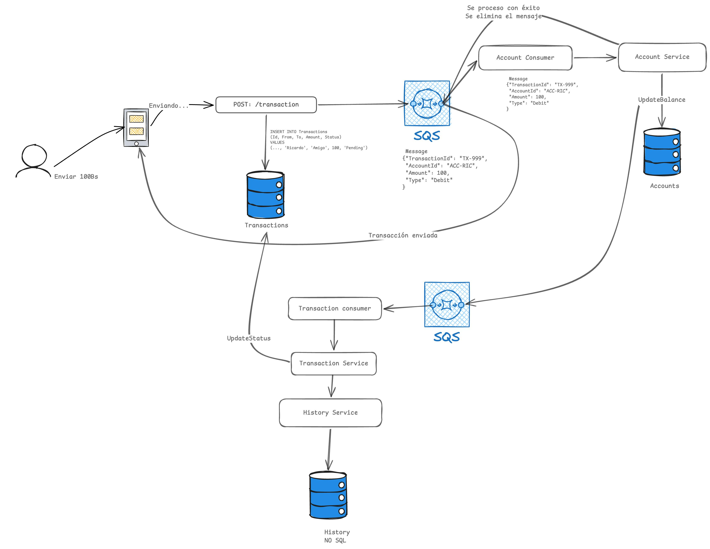

# FlashBank

Solución **.NET 8** con varios servicios (transacciones, cuentas, historial) y mensajería **MassTransit** sobre **Amazon SQS/SNS** vía **LocalStack** en desarrollo.

## Índice

- [Guía de arranque (paso a paso)](#guía-de-arranque-paso-a-paso)
  - [1. Prerrequisitos](#1-prerrequisitos)
  - [2. Clonar el repositorio y situarse en la raíz](#2-clonar-el-repositorio-y-situarse-en-la-raíz)
  - [3. Variables de entorno e infraestructura Docker](#3-variables-de-entorno-e-infraestructura-docker)
  - [4. Alinear configuración .NET con los puertos del compose](#4-alinear-configuración-net-con-los-puertos-del-compose)
  - [5. Restaurar dependencias y ejecutar los servicios](#5-restaurar-dependencias-y-ejecutar-los-servicios)
  - [6. Probar el flujo con `curl`](#6-probar-el-flujo-con-curl)
  - [7. Si algo falla](#7-si-algo-falla)
  - [8. Documentación y scripts útiles](#8-documentación-y-scripts-útiles)
  - [MassTransit](#masstransit)
- [FlashBank — Decisiones técnicas y arquitectura de solución](#flashbank--decisiones-técnicas-y-arquitectura-de-solución)
  - [Diagrama de arquitectura](#diagrama-de-arquitectura)
  - [Contexto del problema](#contexto-del-problema)
  - [1. Arquitectura de microservicios — desacoplamiento entre servicios](#1-arquitectura-de-microservicios--desacoplamiento-entre-servicios)
    - [El problema del acoplamiento](#el-problema-del-acoplamiento)
    - [La solución implementada: mensajería asíncrona vía SQS/SNS con MassTransit](#la-solución-implementada-mensajería-asíncrona-vía-sqssns-con-masstransit)
    - [Resultado](#resultado)
  - [2. Optimización de lectura — el modelo CQRS con MongoDB](#2-optimización-de-lectura--el-modelo-cqrs-con-mongodb)
    - [El problema](#el-problema)
    - [La solución implementada: read model en MongoDB (CQRS)](#la-solución-implementada-read-model-en-mongodb-cqrs)
    - [Por qué MongoDB y no PostgreSQL para lectura](#por-qué-mongodb-y-no-postgresql-para-lectura)
    - [Flujo de escritura al historial](#flujo-de-escritura-al-historial)
  - [3. Consistencia de datos en entornos distribuidos](#3-consistencia-de-datos-en-entornos-distribuidos)
    - [El problema](#el-problema-1)
    - [La solución implementada: compensación por eventos con garantía de entrega](#la-solución-implementada-compensación-por-eventos-con-garantía-de-entrega)
    - [Resumen del contrato de consistencia](#resumen-del-contrato-de-consistencia)
  - [Componentes del repositorio](#componentes-del-repositorio)
  - [Infraestructura (Docker Compose)](#infraestructura-docker-compose)
  - [Referencias](#referencias)

---

## Guía de arranque (paso a paso)

### 1. Prerrequisitos

- [.NET 8 SDK](https://dotnet.microsoft.com/download)
- [Docker](https://docs.docker.com/get-docker/) y Docker Compose
- (Opcional) [AWS CLI](https://aws.amazon.com/cli/) y [`jq`](https://jqlang.github.io/jq/) — solo si quieres ejecutar los scripts de [`scripts/`](scripts/README.md) en tu máquina contra LocalStack (listar colas SQS, inspeccionar mensajes). `jq` sirve para leer el JSON que devuelve `aws`.

### 2. Clonar el repositorio y situarse en la raíz

```bash
cd flashbank
```

La raíz del repo es donde están `docker-compose.yml`, `flashbank.sln`, `.env.example` y la carpeta `init/`.

### 3. Variables de entorno e infraestructura Docker

En la raíz del proyecto, copia la plantilla y deja el archivo que lee Compose:

```bash
cp .env.example .env
```

Los valores de **`.env.example`** están alineados con `FlashBank.*/appsettings.Development.json` (desarrollo local). Si editas `.env`, revisa que usuarios, contraseñas y puertos sigan coincidiendo con esos JSON.

**Para levantar toda la infraestructura (Postgres transacciones y cuentas, MongoDB, LocalStack), basta con:**

```bash
docker compose up -d
```

Eso arranca **postgres-transactions** (**5433**), **postgres-accounts** (**5434**), **mongodb** (**27018**) y **localstack** (**4566**). Los scripts en `init/` crean esquemas, seeds y, al estar listo LocalStack, colas SQS y topics SNS (ver [`init/README.md`](init/README.md)). Si ya tienes un `.env` válido, no necesitas repetir el `cp`; solo ejecuta `docker compose up -d`.

### 4. Alinear configuración .NET con los puertos del compose

En desarrollo, revisa:

- `FlashBank.Transactions/appsettings.Development.json` — Postgres transacciones, MongoDB y bloque `AWS` apuntando a `http://localhost:4566`
- `FlashBank.Accounts/appsettings.Development.json` — Postgres cuentas en **5434**
- `FlashBank.Accounts.Worker/appsettings.Development.json` — misma base de cuentas y `AWS` para LocalStack

### 5. Restaurar dependencias y ejecutar los servicios

Abre **varias terminales** desde la raíz del repo (donde está `flashbank.sln`).

**Terminal A — API de transacciones** (HTTP en [http://localhost:5136](http://localhost:5136), Swagger en `/swagger` según `launchSettings`):

```bash
dotnet restore
dotnet run --project FlashBank.Transactions
```

**Terminal B — Worker de cuentas** (consume `TransactionCreated`, actualiza saldo, publica `TransactionUpdate`):

```bash
dotnet run --project FlashBank.Accounts.Worker
```

**Opcional — API de cuentas** (Swagger en [http://localhost:5232](http://localhost:5232)):

```bash
dotnet run --project FlashBank.Accounts
```

**Opcional — Worker de historial** (`FlashBank.History`; hoy principalmente log / extensión futura):

```bash
dotnet run --project FlashBank.History
```

### 6. Probar el flujo con `curl`

Con **Transactions** y **Accounts.Worker** en marcha, Postgres y LocalStack operativos:

```bash
curl -sS 'http://localhost:5136/transaction' \
  -H 'Content-Type: application/json' \
  -d '{"accountId":"645f0886-982a-4ca4-adba-ced32e8b696b","amount":100,"type":1}'
```

- `type`: `0` = depósito, `1` = retiro (**Withdrawal**).
- Respuesta esperada: **201** con `id` y `status: Pending` si Postgres y LocalStack responden.

**Qué ocurre detrás (resumen):**

1. Validación (`amount > 0`, `accountId` no vacío).
2. Inserción en `transactions` con estado pendiente.
3. Publicación de `TransactionCreated` hacia la topología SQS/SNS.
4. Con el worker de cuentas en marcha: el consumer publica `TransactionUpdate` (completado o fallo) y el consumer en transacciones actualiza el estado en PostgreSQL (y el historial en MongoDB cuando corresponde).

**Verificar en SQL (Postgres transacciones):**

```sql
SELECT id, account_id, amount, type, status, created_at
FROM transactions
ORDER BY created_at DESC
LIMIT 5;
```

### 7. Si algo falla

| Síntoma | Causa habitual |
|--------|----------------|
| `Connection refused` hacia la API | `FlashBank.Transactions` no está en ejecución o el puerto no coincide con `launchSettings`. |
| 500 al guardar | Postgres caído o cadena de conexión incorrecta. |
| 500 tras insertar | LocalStack (SQS/SNS) no accesible o puerto distinto (**4566**). |
| 400 | `amount <= 0` o `accountId` inválido/vacío. |
| Cola SQS “vacía” al inspeccionar | Un consumer .NET ya leyó el mensaje; repetir justo después del POST o pausar el worker para depurar. |

### 8. Documentación y scripts útiles

| Recurso | Contenido |
|---------|-----------|
| [`.env.example`](.env.example) | Plantilla de variables para Docker; cópiala a `.env` antes del primer `docker compose up -d`. |
| [`init/README.md`](init/README.md) | SQL seeds, MongoDB y creación de colas al levantar Docker. |
| [`scripts/README.md`](scripts/README.md) | Listar colas y ver mensajes SQS en LocalStack (`jq` + AWS CLI). |
| [`docs/testing/sqs-desde-docker.md`](docs/testing/sqs-desde-docker.md) | Mismo enfoque con `awslocal` dentro del contenedor LocalStack. |
| [`docs/solucion-flashbank.md`](docs/solucion-flashbank.md) | Misma narrativa de arquitectura que la sección siguiente (útil si lees el repo en GitHub solo con `/docs`). |

### MassTransit

El repo usa **MassTransit 8.x** (p. ej. 8.5.5 con `MassTransit.AmazonSQS`). Las versiones **9+** requieren licencia comercial; mantener 8.x es coherente con .NET 8 y desarrollo sin `MT_LICENSE`.

---

## FlashBank — Decisiones técnicas y arquitectura de solución

### Diagrama de arquitectura



---

### Contexto del problema

FlashBank es un neobanco que migra desde un monolito hacia microservicios para escalar ante el crecimiento de usuarios. El dolor más concreto reportado es el endpoint `GET /accounts/{id}/history`, cuya consulta directa sobre la tabla `transactions` (con cientos de millones de filas) genera picos de CPU del 95% en la base de datos relacional. La prueba técnica exige resolver tres problemas interrelacionados.

---

### 1. Arquitectura de microservicios — desacoplamiento entre servicios

#### El problema del acoplamiento

En un monolito o en microservicios mal diseñados, el servicio de **Transacciones** llamaría directamente (HTTP síncrono) al servicio de **Cuentas** para actualizar el saldo. Esto crea acoplamiento temporal: si Cuentas está caído o lento, Transacciones también falla. Los servicios evolucionan juntos y no pueden desplegarse de forma independiente.

#### La solución implementada: mensajería asíncrona vía SQS/SNS con MassTransit

Transacciones y Cuentas no se conocen entre sí. Se comunican **exclusivamente a través de eventos**, siguiendo el patrón **Event-Driven Architecture**:

```
Cliente
  │
  ▼
POST /transaction                     ← FlashBank.Transactions (API)
  │  Persiste Tx (Pending) en PostgreSQL
  │  Publica TransactionCreated → SNS topic "transaction-created"
  │
  ▼
SQS "transaction-created-queue"
  │
  ▼
AccountConsumer                       ← FlashBank.Accounts.Worker
  │  Actualiza saldo en PostgreSQL
  │  Publica TransactionUpdate (Completed | Failed) → SNS topic "transaction-update"
  │
  ▼
SQS "transaction-update-queue"
  │
  ▼
TransactionConsumer                   ← FlashBank.Transactions
  │  Actualiza estado de Tx en PostgreSQL
  └─ Escribe documento en MongoDB     ← Modelo de lectura (historial)
```

MassTransit 8.x abstrae el transporte (Amazon SQS + SNS) y define los nombres de entidad explícitamente (`SetEntityName`), lo que alinea publishers y consumers sin que ningún servicio conozca la dirección física del otro. En desarrollo, **LocalStack** emula toda la infraestructura AWS en el puerto `4566`; el script `init/init-aws.sh` crea colas, topics SNS y suscripciones al arrancar el contenedor.

#### Resultado

- **Transacciones** y **Cuentas** despliegan, escalan y fallan de forma completamente independiente.
- Si el worker de Cuentas está caído, el mensaje queda retenido en la cola SQS hasta que vuelva. La API de Transacciones sigue respondiendo.
- Agregar nuevos consumidores (por ejemplo, auditoría, notificaciones push) solo requiere suscribirse al topic SNS sin tocar código existente.

---

### 2. Optimización de lectura — el modelo CQRS con MongoDB

#### El problema

El endpoint `GET /accounts/{id}/history` ejecuta un `SELECT` sobre `transactions` cada vez que un usuario abre la app. Con cientos de millones de registros, esa tabla relacional no está optimizada para lecturas de historial paginado por cuenta; cada consulta golpea índices grandes y compite con las escrituras del flujo transaccional.

#### La solución implementada: read model en MongoDB (CQRS)

Se aplica el patrón **CQRS (Command Query Responsibility Segregation)**: el lado de escritura sigue siendo PostgreSQL (source of truth transaccional), pero se mantiene un **modelo de lectura desnormalizado** en MongoDB diseñado específicamente para la consulta de historial.

Cada vez que una transacción alcanza un estado final (`Completed` o `Failed`), `TransactionService.UpdateStatusAsync` escribe un documento en la colección `transaction-history` de MongoDB:

```csharp
// FlashBank.Transactions/Services/TransactionService.cs
var historyDoc = new TransactionHistoryDocument
{
    TransactionId = transaction.Id,
    AccountId     = transaction.AccountId,
    Amount        = transaction.Amount,
    Type          = transaction.Type.ToString(),
    Status        = transaction.Status.ToString(),
    OccurredAt    = DateTime.UtcNow
};
await _history.InsertAsync(historyDoc, ct);
```

El documento `TransactionHistoryDocument` está aplanado: sin joins, sin relaciones. Una consulta de historial para una cuenta es un simple `find({ accountId: "..." })` sobre una colección optimizada para lectura, con índice sobre `accountId`.

#### Por qué MongoDB y no PostgreSQL para lectura

| | PostgreSQL (write side) | MongoDB (read side) |
|---|---|---|
| Modelo | Relacional normalizado | Documentos desnormalizados |
| Acceso | Escritura transaccional | Lectura por `accountId` |
| Escala | Vertical + replicación | Escalabilidad horizontal nativa |
| Carga en pico | Alta (miles de escrituras/seg) | Aislada (sin competencia con writes) |

Al separar las bases de datos por responsabilidad, el pico de CPU en la base relacional desaparece para las consultas de historial: esas lecturas **nunca más tocan PostgreSQL**.

#### Flujo de escritura al historial

El diseño es deliberado: el historial se escribe **solo con estado definitivo** para evitar registrar movimientos intermedios (`Pending`). `FlashBank.History` existe como servicio independiente con su propio consumer de `TransactionCreated`, pero actualmente solo registra un log; la escritura efectiva ocurre en `TransactionService` porque en ese punto ya existe el estado final y los datos completos de la transacción.

---

### 3. Consistencia de datos en entornos distribuidos

#### El problema

En un sistema distribuido, una transacción puede persistirse en PostgreSQL pero fallar antes de que el saldo de la cuenta se actualice (o viceversa). Sin un mecanismo de compensación, los datos quedarían inconsistentes: la transacción marcada como `Completed` pero el saldo sin modificar, o el saldo debitado sin registro de transacción.

#### La solución implementada: compensación por eventos con garantía de entrega

La consistencia se garantiza mediante una **saga de compensación** implícita en el flujo de eventos, aprovechando las garantías **at-least-once** de SQS:

**Paso 1 — Escritura local primero.** El servicio de Transacciones persiste la fila con estado `Pending` en su propia base PostgreSQL *antes* de publicar el evento. Si la publicación falla, la transacción queda en `Pending` indefinidamente (detectable y recuperable con un job de reconciliación).

**Paso 2 — Procesamiento atómico en Cuentas.** `AccountConsumer` ejecuta `UpdateBalanceAsync` dentro de la unidad de trabajo de EF Core. Si el `SaveChangesAsync` falla (por ejemplo, fondos insuficientes o cuenta inexistente), se lanza una excepción y **no se confirma el mensaje** a SQS; MassTransit lo deja disponible para reintento.

**Paso 3 — Compensación explícita en el `catch`.** Si `UpdateBalanceAsync` lanza cualquier excepción (incluyendo fondos insuficientes), `AccountConsumer` captura el error y publica `TransactionUpdate` con estado `Failed`:

```csharp
// FlashBank.Accounts.Worker/Consumers/AccountConsumer.cs
catch (Exception ex)
{
    var update = new TransactionUpdate(
        msg.TransactionId,
        msg.AccountId,
        TransactionStatus.Failed,
        ex.Message);

    await context.Publish(update);
}
```

Este evento de compensación viaja por la misma topología SNS/SQS y llega a `TransactionConsumer`, que actualiza el estado en PostgreSQL a `Failed`. El saldo **nunca se toca** si hay error; la base de cuentas permanece coherente.

**Paso 4 — Idempotencia.** Si el broker reintentara un mensaje ya procesado, `UpdateBalanceAsync` aplicaría el movimiento dos veces. Para producción, la extensión natural es agregar una columna `ProcessedTransactionIds` o una tabla de idempotencia en la base de cuentas, que evite procesar el mismo `TransactionId` más de una vez.

#### Resumen del contrato de consistencia

| Escenario | Estado en PostgreSQL Tx | Estado en PostgreSQL Accounts |
|---|---|---|
| Flujo exitoso | `Completed` | Saldo actualizado |
| Cuenta no encontrada | `Failed` | Sin cambio |
| Fondos insuficientes | `Failed` | Sin cambio |
| Worker caído (SQS retiene msg) | `Pending` | Sin cambio (reintento posterior) |
| Error transitorio en Accounts | `Pending` → `Completed` tras reintento | Actualizado en reintento |

El saldo de la cuenta **nunca queda afectado** en un estado inconsistente respecto al estado de la transacción.

---

### Componentes del repositorio

| Proyecto | Rol |
|---------|-----|
| `FlashBank.Transactions` | API REST (`POST /transaction`), publicación de `TransactionCreated`, consumo de `TransactionUpdate`, escritura al historial en MongoDB. |
| `FlashBank.Accounts.Worker` | Consume `TransactionCreated`, actualiza saldo, publica `TransactionUpdate` (Completed o Failed). |
| `FlashBank.Accounts` | API de gestión de cuentas (creación, consulta de saldo). |
| `FlashBank.History` | Worker suscrito a `TransactionCreated` para extensión futura (actualmente en modo pasivo/log). |
| `FlashBank.Shared` | Contratos de eventos (`TransactionCreated`, `TransactionUpdate`) y enums compartidos. |

### Infraestructura (Docker Compose)

| Servicio | Puerto host | Propósito |
|---------|------------|-----------|
| `postgres-transactions` | 5433 | Write side de transacciones |
| `postgres-accounts` | 5434 | Write side de cuentas |
| `mongodb` | 27018 | Read model / historial |
| `localstack` | 4566 | Emulación de SQS + SNS en desarrollo |

---

### Referencias

- Inicialización SQL, Mongo y colas AWS: [`init/README.md`](init/README.md)
- Inspección de colas SQS: [`scripts/README.md`](scripts/README.md) y [`docs/testing/sqs-desde-docker.md`](docs/testing/sqs-desde-docker.md)
- Copia de esta arquitectura en Markdown: [`docs/solucion-flashbank.md`](docs/solucion-flashbank.md)
